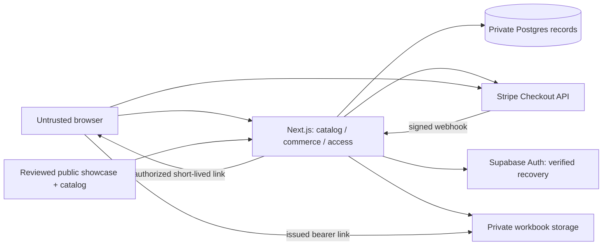

# Architecture

Baseline: `750a66015c9a716583f8d39a89007571805e33ec`, `main`; Next.js 16.3.4, React 19.2.8, TypeScript, App Router, ESLint. Only an application shell exists. Everything below is a target, not implemented infrastructure.

**CURRENT:** one Next.js modular monolith, one Postgres database through Supabase, private Supabase Storage, Supabase Auth for recovery, Stripe-hosted Checkout. [ADR 0001](decisions/0001-application-shape.md) records alternatives and admin strategy.

## Module boundaries

| Area (suggested, not required scaffolding) | Responsibility / dependency rule |
| --- | --- |
| `app/` | Routes and composition; delegate domain decisions, keep public pages cacheable. |
| `lib/catalog/`, `content/products/` | [Product contract](contracts/product.md); public projections only. |
| `lib/showcase/`, `content/showcases/` | [Showcase contract](contracts/showcase.md); no commerce, storage or workbook dependency. |
| `lib/commerce/` | [Checkout contract](contracts/checkout.md); order/payment persistence and provider adapter. |
| `lib/access/` | [Entitlement contract](contracts/entitlement.md); ownership, recovery and download authorization. Depends on recorded payment evidence, not browser payment claims. |
| `lib/server/` | Privileged provider clients/configuration, never imported into client modules. |

Server Components may produce only deliberate public projections. Client components own demo controls and status display. All browser values remain untrusted at server entry points. Authenticated access/status/download responses are private and non-cacheable; never share user data through static generation or a shared cache.

## Persistence and operations

Postgres owns immutable commercial snapshots, provider references, processing state, entitlements, hashed guest capabilities and download audit records. Public editorial metadata stays in Git. A server-only sale mapping binds product/version to current provider price; historical orders never derive prices from edited catalog content.

No browser writes to commerce/access tables or storage. Prefer a non-exposed schema through a server adapter; explicitly configure grants and RLS for any exposed tables, with ownership-scoped reads only if actually needed. Privileged server clients bypassing RLS must still execute domain authorization checks. Never authorize through user-editable auth metadata.

Webhooks synchronously run a bounded transactional processor; database uniqueness and locking provide idempotency. No queue/service bus initially. Failed transactions are retried by provider delivery or a protected operator reconciliation path using the same processor. Persist processing errors separately when possible; do not acknowledge failed work as completed. T07/T12 define executable recovery evidence.

An email from checkout is a recovery destination, not verified identity. Same-browser paid access and verified cross-browser recovery are distinct credentials under [entitlement](contracts/entitlement.md). No password registration or implicit email-based login.

Original workbooks live outside Git and build inputs. Only the server resolves a permitted immutable version to a private object. Link expiry and revocation limits are in the access contract; after legitimate download, copying cannot be prevented.

## Dependency gates

No dependencies added in inception. These gates authorize evaluation, not automatic installation; record exact packages/versions and obtain lead approval for a new durable dependency.

| Dependency | Earliest justification |
| --- | --- |
| Test tooling | T02: smallest runner for domain tests; browser tooling when T03/T04 need interaction checks. Avoid overlapping runners. |
| Schema validator | T02/T03 only if runtime input validation outweighs small explicit guards. TypeScript alone does not validate external data. |
| Chart library | T04 only if native SVG/HTML cannot serve the first demo accessibly. |
| Form library | Repeated complex form state; native controls suffice for MVP inputs. |
| Supabase database client | T05 for actual persistence; Auth/SSR support at T11, storage at T09. |
| Stripe SDK | T06 for hosted checkout and T07 signature/provider verification. |
| Analytics | After launch baseline; start with operational counters, no third-party tracking dependency. |

Use installed Next.js documentation before framework code. Before T05 verify supported deployment Node version, SDKs and explicit API grants against current docs; baseline `@types/node` is not a runtime compatibility guarantee. The current [Supabase changelog](https://supabase.com/changelog) reports Node 20 client support removal and Data API exposure changes. No SDK-specific API is prescribed here.
